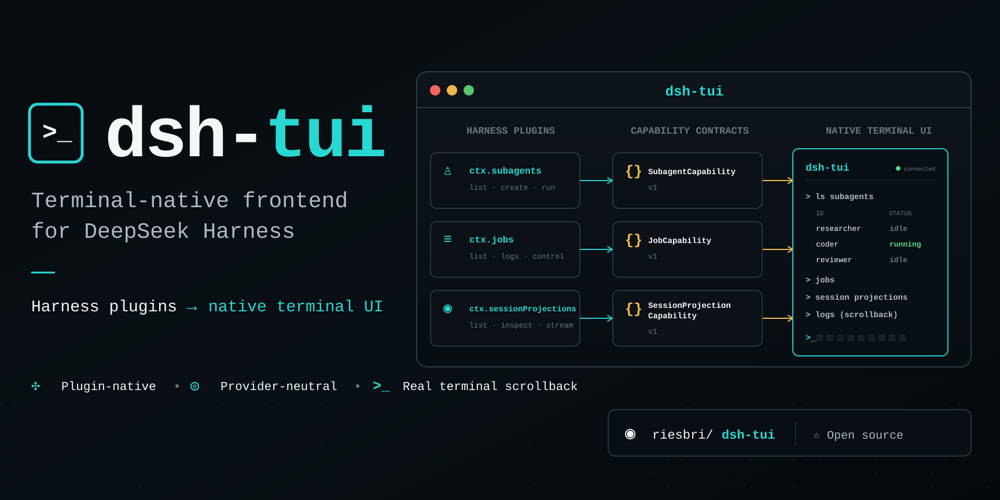
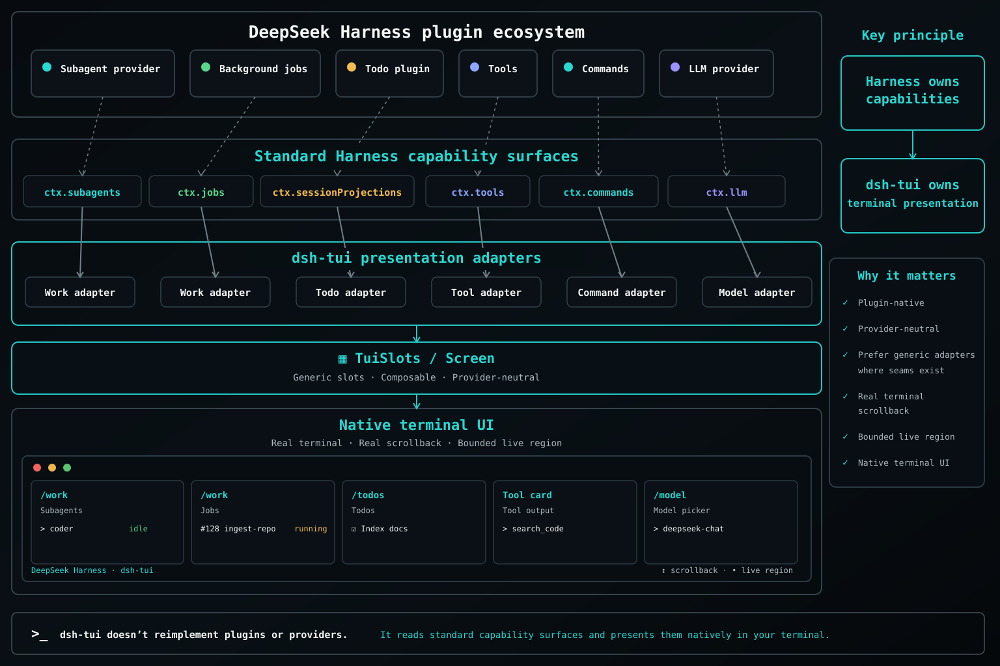

<p align="center">
  
</p>

# dsh-tui

**The terminal-native frontend for the [DeepSeek Harness](https://github.com/deepseek-ai/deepseek-harness) plugin ecosystem.**

[](https://www.npmjs.com/package/@riesbri/dsh-tui)
[](https://github.com/riesbri/dsh-tui/actions/workflows/ci.yml)
[](https://scorecard.dev/viewer/?uri=github.com/riesbri/dsh-tui)
[](LICENSE)

## Install

```sh
dsh plugin --profile tui add @riesbri/dsh-tui
dsh --profile tui
```

See [Install](docs/install.md) for requirements, verification, the `dshtui` launcher, and source installs.

> [!WARNING]
> Tool permissions and sandbox policy come from the active Harness profile. In a standard setup, ordinary tool calls can run in the working folder without review. Read [Permissions and the sandbox](docs/usage.md#permissions-and-the-sandbox) before using it on code you care about.

## Why dsh-tui?

Harness plugins publish capabilities; dsh-tui presents supported capabilities natively in the terminal. It runs in-process and consumes Harness contracts rather than creating separate provider runtimes, state stores, or policy.

`Harness plugin → standard capability → dsh-tui presentation adapter → native terminal UI`

Harness owns capabilities, state, runtime, persistence, and policy. dsh-tui owns terminal presentation.

<p align="center">
  
</p>

### Generic capability integration

dsh-tui prefers standard Harness capability surfaces over provider-specific implementations. This boundary guides both current presentations and future work, from Work and session projections to planned attachments, instead of becoming a collection of separate engines.

See [Architecture](docs/architecture.md) for the capability model and current adapter boundaries.

### Native terminal by design

Finished output is committed to real terminal scrollback and never rewritten. Normal scrolling, selection, and copying keep working while dsh-tui redraws only a bounded live region. The Harness-independent renderer stays small, dependency-light, and focused on terminal correctness: widths, Unicode, escaping, keys, and safe redraws.

See [Design](docs/design.md) for the terminal invariants and [Comparison](docs/comparison.md) for the trade-offs.

## Use and contribute

Type `/` to discover the commands and capabilities available in the active Harness profile. [Usage](docs/usage.md) covers keys, sessions, commands, and permission guidance.

Contributions are welcome, especially generic capability adapters, terminal robustness, cross-platform verification, Unicode/CJK correctness, sessions, attachments, and focused UX improvements. Start with [CONTRIBUTING.md](CONTRIBUTING.md), then read [AGENTS.md](AGENTS.md) and the canonical [Roadmap](ROADMAP.md).

## Documentation

- [Install](docs/install.md)
- [Usage](docs/usage.md)
- [Architecture](docs/architecture.md)
- [Design](docs/design.md)
- [Roadmap](ROADMAP.md)
- [Comparison](docs/comparison.md)
- [Contributing](CONTRIBUTING.md)
- [Security](SECURITY.md)

## License

[MIT](LICENSE). Not affiliated with or endorsed by DeepSeek.
